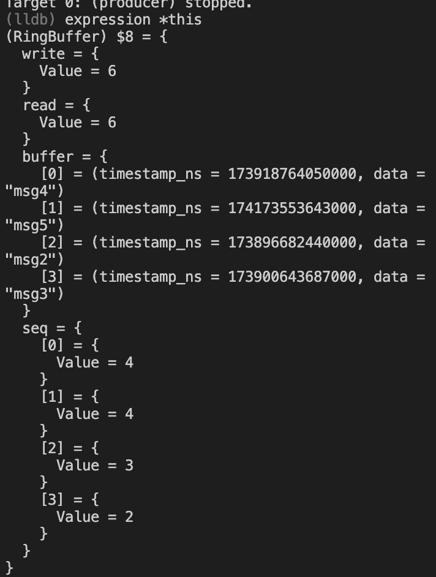

cmake setup 
'''
cd build 
make 
./producer 
./consumer
./inspector 
'''
(last three in separate terminals)

summary
in low latency systems, there is a need to log information being transferred 1- at the time of transfer 2- without slowing down the transfer. 
spsc describes a system with a single producer and a single consumer. this limit on the system give us some guarantees about what we need to protect in terms of multiple processes. 

design steps: 

shared memory vs sockets: shared memory has the latency benefit of the kernel not needing to mediate between producer and consumer. sockets require that the kernel copy messages into a buffer, and send sockets even if its in the same machine (unix domain sockets). shared memory instead has the kernel (in mmap) define shared memory in their virtual memory, and then use that. memory accesses are immediate as the consumer can simply read from shared memory. 

ring buffer: we could do a single buffer in shared memory that handles the most recently sent message that the producer sends. but remember how fast information can be sent, which means the consumer may miss messages (dropped messages). a ring buffer maps around an x number of buffers, essentially filling the ring until it hits capacity x, at which point it wraps around to the 0th spot. this lets us hold the x most recent messages instead. the consumer then needs a way to keep track of what it needs to read, and the producer logs what it has written. Thus, the ring buffer keeps track of read index and write index (which we must make sure the compiler does not rearrange the load and stores to prevent TOCTOU issues). 
if at any point, the read index is more than the capacity behind write, then the consumer has dropped messages and initializes its index to the oldest message in the ring buffer. 
optimizations: 
- atomic read and write indices: make sure the memory order is fixed for stores and loads to prevent compiler rearranges. "std::atomic<uint32_t>::is_always_lock_free" in the headerfile ensures that the machine supports atomic operations for this particularly type. we as a programmer cannot control the atomicity(? lol) of operations, but we can use static assert to ensure it at compile time. 

- size capacity: there are three ways i would say to navigate hitting buffer capacity 
    1) size your buffer reasonably to make buffer overflows rare. this takes into account the rate of producer vs rate of consumer. we idealistically wrapped these two processes in tight loops, with only the producer given a sleep(1). 
    2) stall the producer when to wait for the consumer to catch up. realistically this isnt all that helpful for low latency systems where the producer cant just wait. 
    3) just have the consumer miss messages by tracking where the last write and read are. 

limit of spsc: 
we don't really consider multiple producers in this implementation. suppose we did, then we would need to ensure slots by the producer are taken correctly (which may require locks)

lock-free: 
this method isn't always better than mutexes, but often is better in SPSC programs- and should be used sparingly due to the difficulty implementing lock free algos (dont roll your own lock free algos). in this case, the bottleneck for other processes would be the mutex placed on the ringbuffer, as the consumer is actively waiting on that. since it is a relatively simple read and write, we can use atomics on ARM architecture to guarantee the same as a mutex would. if the producer writes to the write index, the consumer is guaranteed to see the write index correctly since all loads of write will be assigned after the store (by memory order). 

seqlock: 
we do however have a sequence lock in the inspector to ensure that writes are not viewed while being made. 
1) why this is only needed for inspector and not consumer? the publish function in ring buffer ensures that write is updated atomically, after the message has been updated. this is checked by the consumer, which ensures no race conditions between our producer and consumer. our inspector, however, is outside of the SPSC protocal and has no awareness of what is being written to. 
2) in this, we see that a seq lock uses a bit of bit math (get it?) to check that the buffer it is reading is 1- done being written 2- the same message as intended (such that the buffer has not been lapped). 

lldb: 
lldb is apple's gdb which is kinda cool. it let me view the ringbuffer in json!

as you can see, writes wrap around the ringbuffer, if i step through the seq lock updater, we see an odd number, and the ringbuffer updates sequentially.

## Two implementations: 

Lock-free: p50 averages ~23µs, p99 averages ~32µs
Mutex: p50 averages ~33µs, p99 averages ~48µs

lock-free variances is lower, so more predictable. 

Averages for both remain the same with and without the inspector included.